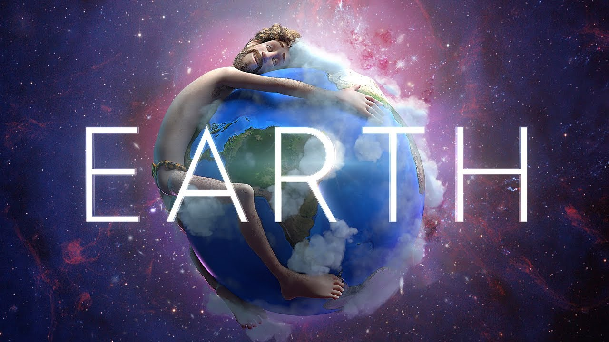
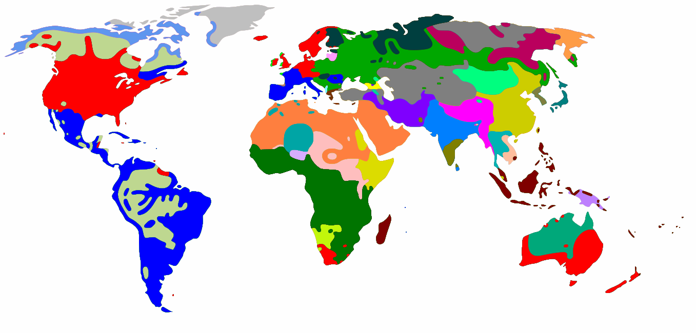

## 1. Local and global thought patterns

<p>While we might not be Twitter fans, we have to admit that it has a huge influence on the world (who doesn't know about Trump's tweets). Twitter data is not only gold in terms of insights, but <strong><em>Twitter-storms are available for analysis in near real-time</em></strong>. This means we can learn about the big waves of thoughts and moods around the world as they arise. </p>
<p>As any place filled with riches, Twitter has <em>security guards</em> blocking us from laying our hands on the data right away ⛔️ Some  authentication steps (really straightforward) are needed to call their APIs for data collection. Since our goal today is learning to extract insights from data, we have already gotten a green-pass from security ✅ Our data is ready for usage in the datasets folder — we can concentrate on the fun part! 🕵️‍♀️🌎
<br>
<br>

<hr>
<br>Twitter provides both global and local trends. Let's load and inspect data for topics that were hot worldwide (WW) and in the United States (US) at the moment of query  — snapshot of JSON response from the call to Twitter's <i>GET trends/place</i> API.</p>
<p><i><b>Note</b>: <a href="https://developer.twitter.com/en/docs/trends/trends-for-location/api-reference/get-trends-place.html">Here</a> is the documentation for this call, and <a href="https://developer.twitter.com/en/docs/api-reference-index.html">here</a> a full overview on Twitter's APIs.</i></p>

```python
# Loading json module
import json

# Load WW_trends and US_trends data into the the given variables respectively
WW_trends = json.loads(open('datasets/WWTrends.json').read())
US_trends = json.loads(open('datasets/USTrends.json').read())
```

<p>Our data was hard to read! Luckily, we can resort to the <i>json.dumps()</i> method to have it formatted as a pretty JSON string.</p>

```python
# Pretty-printing the results. First WW and then US trends.

print("WW trends:")
json.dumps(WW_trends,indent = 1)
```

<details>
  <summary>Expand Output</summary>

```js
WW trends:
  [
   {
    "trends": [
     {
      "name": "#BeratKandili",
      "url": "http://twitter.com/search?q=%23BeratKandili",
      "promoted_content": null,
      "query": "%23BeratKandili",
      "tweet_volume": 46373
     },
     {
      "name": "#GoodFriday",
      "url": "http://twitter.com/search?q=%23GoodFriday",
      "promoted_content": null,
      "query": "%23GoodFriday",
      "tweet_volume": 81891
     },
     {
      ...
     },
     {
      "name": "#JunquerasACN",
      "url": "http://twitter.com/search?q=%23JunquerasACN",
      "promoted_content": null,
      "query": "%23JunquerasACN",
      "tweet_volume": null
     }
    ],
    "as_of": "2019-04-19T08:43:43Z",
    "created_at": "2019-04-19T08:39:15Z",
    "locations": [
     {
      "name": "Worldwide",
      "woeid": 1
     }
    ]
   }
  ]  
```

</details>

```python
print("\n", "US trends:")
json.dumps(US_trends,indent = 1)
```

<details>
  <summary>Expand Output</summary>

```js
US trends:
  [
   {
    "trends": [
     {
      "name": "#WeLoveTheEarth",
      "url": "http://twitter.com/search?q=%23WeLoveTheEarth",
      "promoted_content": null,
      "query": "%23WeLoveTheEarth",
      "tweet_volume": 159698
     },
     {
      "name": "#DragRace",
      "url": "http://twitter.com/search?q=%23DragRace",
      "promoted_content": null,
      "query": "%23DragRace",
      "tweet_volume": 37166
     },
     {
      ...
     },
     {
      "name": "#WeirdDateStories",
      "url": "http://twitter.com/search?q=%23WeirdDateStories",
      "promoted_content": null,
      "query": "%23WeirdDateStories",
      "tweet_volume": null
     },
     {
      "name": "#HustleAndSoul",
      "url": "http://twitter.com/search?q=%23HustleAndSoul",
      "promoted_content": null,
      "query": "%23HustleAndSoul",
      "tweet_volume": null
     },
     {
      "name": "#fridaymotivation",
      "url": "http://twitter.com/search?q=%23fridaymotivation",
      "promoted_content": null,
      "query": "%23fridaymotivation",
      "tweet_volume": null
     }
    ],
    "as_of": "2019-04-19T08:43:43Z",
    "created_at": "2019-04-19T08:39:15Z",
    "locations": [
     {
      "name": "United States",
      "woeid": 23424977
     }
    ]
   }
  ]
```

</details>

## 3.  Finding common trends

<p>🕵️‍♀️ From the pretty-printed results (output of the previous task), we can observe that:</p>
<ul>
<li><p>We have an array of trend objects having: the name of the trending topic, the query parameter that can be used to search for the topic on Twitter-Search, the search URL and the volume of tweets for the last 24 hours, if available. (The trends get updated every 5 mins.)</p></li>
<li><p>At query time <b><i>#BeratKandili, #GoodFriday</i></b> and <b><i>#WeLoveTheEarth</i></b> were trending WW.</p></li>
<li><p><i>"tweet_volume"</i> tell us that <i>#WeLoveTheEarth</i> was the most popular among the three.</p></li>
<li><p>Results are not sorted by <i>"tweet_volume"</i>. </p></li>
<li><p>There are some trends which are unique to the US.</p></li>
</ul>
<hr>
<p>It’s easy to skim through the two sets of trends and spot common trends, but let's not do "manual" work. We can use Python’s <strong>set</strong> data structure to find common trends — we can iterate through the two trends objects, cast the lists of names to sets, and call the intersection method to get the common names between the two sets.</p>

```python
# Extracting all the WW trend names from WW_trends
world_trends = set([WW_trends[0]['trends'][i]['name'] for i in range(len(WW_trends[0]['trends']))])

# Extracting all the US trend names from US_trends
us_trends =  set([US_trends[0]['trends'][i]['name'] for i in range(len(US_trends[0]['trends']))])

# Getting the intersection of the two sets of trends
common_trends = world_trends.intersection(us_trends)

# Inspecting the data
world_trends
```

<details>
  <summary>Expand Output</summary>

```js
  {'#195TLdenTTVerilir',
   '#19aprile',
   '#AFLNorthDons',
   '#BLACKPINKxCorden',
   '#BeratKandili',
   '#CHIvLIO',
   '#ConCalmaRemix',
   '#DinahJane1',
   '#DragRace',
   '#DuyguAsena',
   '#GoodFriday',
   '#HanumanJayanti',
   '#HardikPatel',
   '#HayırlıCumalar',
   '#HayırlıKandiller',
   '#IndonesianElectionHeroes',
   '#Jersey',
   '#JunquerasACN',
   '#Karfreitag',
   '#KpuJanganCurang',
   '#NRLBulldogsSouths',
   '#NikahUmurBerapa',
   '#Ontas',
   '#ProtestoEdiyorum',
   '#ShivSena',
   '#TheJudasInMyLife',
   '#ViernesSanto',
   '#WeLoveTheEarth',
   '#اغلاق_BBM',
   '#يوم_الجمعه',
   'Berat Kandilimiz',
   'Derrick White',
   'Derry',
   'Hemant Karkare',
   'Lil Dicky',
   'Lyra McKee',
   'Priyanka Chaturvedi',
   'Shiv Sena',
   'örgütdeğil arkadaşgrubu',
   'グレア',
   'プリウス',
   '免許返納',
   '刀ステ',
   '十二国記',
   '東京・池袋衝突事故',
   '歩行者',
   '池袋の事故',
   '重体の女性と女児',
   '高齢者',
   '브이알'}
```

</details>

```python
us_trends
```

<details>
  <summary>Expand Output</summary>

```js
  {'"Earth"',
   '#AFLNorthDons',
   '#BLACKPINKxCorden',
   '#CUZILOVEYOU',
   '#ConCalmaRemix',
   '#CriticalRoleSpoilers',
   '#DinahJane1',
   '#DontChangeOutNow',
   '#DragRace',
   '#Earth',
   '#FridayFeeling',
   '#GSWvsLAC',
   '#GossipShouldBe',
   '#HustleAndSoul',
   '#LilDicky',
   '#MakeAMovieSensual',
   '#MyDrunkUncleSays',
   '#MyInnerDemonSaid',
   '#NRLBulldogsSouths',
   '#RPDR',
   '#StarTrekDiscovery',
   '#TheLegendOfVoxMachina',
   '#TimeToImpeach',
   '#WGAMIX',
   '#WeLoveTheEarth',
   '#WeirdDateStories',
   '#WhatStopsYouFromGoingHome',
   '#WorldofWarcraftMains',
   '#fridaymotivation',
   '#rupaulsdragrace',
   'David Fletcher',
   'Derrick White',
   'Derry',
   'Gallant',
   'Game 6',
   'George Conway',
   'Kazuo Koike',
   'Kevin Durant',
   'Lil Dicky',
   'Lone Wolf and Cub',
   'Lyra McKee',
   'Mike Anderson',
   'Oshie',
   'Servais',
   'Seth Abramson',
   'Shy Glizzy',
   'Silky',
   'Tomas Hertl',
   'WE LOVE THE EARTH',
   'Yvie'}
```

</details>

```python
print (len(common_trends), "common trends:", common_trends)
```

<details>
  <summary>Expand Output</summary>
  
  \\`\\`\\`
    11 common trends: {'#ConCalmaRemix', '#BLACKPINKxCorden', 'Derry', 'Lil Dicky', 'Derrick White', '#WeLoveTheEarth', '#DragRace', '#AFLNorthDons', 'Lyra McKee', '#NRLBulldogsSouths', '#DinahJane1'}
  \\`\\`\\`
</details>

## 4. Exploring the hot trend

<p>🕵️‍♀️ From the intersection (last output) we can see that, out of the two sets of trends (each of size 50), we have 11 overlapping topics. In particular, there is one common trend that sounds very interesting: <i><b>#WeLoveTheEarth</b></i> — so good to see that <em>Twitteratis</em> are unanimously talking about loving Mother Earth! 💚 </p>
<p><i><b>Note</b>: We could have had no overlap or a much higher overlap; when we did the query for getting the trends, people in the US could have been on fire obout topics only relevant to them.</i>
<br>
</p>
<div style="text-align: center;"><i>Image Source:Official Music Video Cover: https://welovetheearth.org/video/</i></div>
<hr>
<p>We have found a hot-trend, #WeLoveTheEarth. Now let's see what story it is screaming to tell us! <br>
If we query Twitter's search API with this hashtag as query parameter, we get back actual tweets related to it. We have the response from the search API stored in the datasets folder as <i>'WeLoveTheEarth.json'</i>. So let's load this dataset and do a deep dive in this trend.</p>

```python
# Loading the data
tweets = json.loads(open('datasets/WeLoveTheEarth.json').read())

# Inspecting some tweets
tweets[0:2]
```

<details>
  <summary>Expand Output</summary>

```js
  [{'created_at': 'Fri Apr 19 08:46:48 +0000 2019',
    'id': 1119160405270523904,
    'id_str': '1119160405270523904',
    'text': 'RT @lildickytweets: 🌎 out now #WeLoveTheEarth https://t.co/L22XsoT5P1',
    'truncated': False,
    'entities': {'hashtags': [{'text': 'WeLoveTheEarth', 'indices': [30, 45]}],
     'symbols': [],
     'user_mentions': [{'screen_name': 'lildickytweets',
       'name': 'LD',
       'id': 1209516660,
       'id_str': '1209516660',
       'indices': [3, 18]}],
     'urls': [{'url': 'https://t.co/L22XsoT5P1',
       'expanded_url': 'https://youtu.be/pvuN_WvF1to',
       'display_url': 'youtu.be/pvuN_WvF1to',
       'indices': [46, 69]}]},
    'metadata': {'iso_language_code': 'en', 'result_type': 'recent'},
    'source': '<a href="http://twitter.com/download/android" rel="nofollow">Twitter for Android</a>',
    'in_reply_to_status_id': None,
    'in_reply_to_status_id_str': None,
    'in_reply_to_user_id': None,
    'in_reply_to_user_id_str': None,
    'in_reply_to_screen_name': None,
    'user': {'id': 212375312,
     'id_str': '212375312',
     'name': 'fake smile',
     'screen_name': 'Pati95Poland',
     'location': 'SWAGLAND   ',
     'description': "''you just got knocked the fuck out''",
     'url': 'https://t.co/nxzlSyYZSK',
     'entities': {'url': {'urls': [{'url': 'https://t.co/nxzlSyYZSK',
         'expanded_url': 'http://loveeeujdb.tumblr.com/',
         'display_url': 'loveeeujdb.tumblr.com',
         'indices': [0, 23]}]},
      'description': {'urls': []}},
     'protected': False,
     'followers_count': 2306,
     'friends_count': 697,
     'listed_count': 28,
     'created_at': 'Fri Nov 05 22:25:29 +0000 2010',
     'favourites_count': 5552,
     'utc_offset': None,
     'time_zone': None,
     'geo_enabled': True,
     'verified': False,
     'statuses_count': 185750,
     'lang': 'pl',
     'contributors_enabled': False,
     'is_translator': False,
     'is_translation_enabled': False,
     'profile_background_color': 'FFFFFF',
     'profile_background_image_url': 'http://abs.twimg.com/images/themes/theme18/bg.gif',
     'profile_background_image_url_https': 'https://abs.twimg.com/images/themes/theme18/bg.gif',
     'profile_background_tile': False,
     'profile_image_url': 'http://pbs.twimg.com/profile_images/1093929135183937537/hQuxtwKq_normal.jpg',
     'profile_image_url_https': 'https://pbs.twimg.com/profile_images/1093929135183937537/hQuxtwKq_normal.jpg',
     'profile_banner_url': 'https://pbs.twimg.com/profile_banners/212375312/1522705183',
     'profile_link_color': 'ABB8C2',
     'profile_sidebar_border_color': 'FFFFFF',
     'profile_sidebar_fill_color': 'F6F6F6',
     'profile_text_color': '333333',
     'profile_use_background_image': True,
     'has_extended_profile': True,
     'default_profile': False,
     'default_profile_image': False,
     'following': False,
     'follow_request_sent': False,
     'notifications': False,
     'translator_type': 'regular'},
    'geo': None,
    'coordinates': None,
    'place': None,
    'contributors': None,
    'retweeted_status': {'created_at': 'Fri Apr 19 04:22:29 +0000 2019',
     'id': 1119093888524754946,
     'id_str': '1119093888524754946',
     'text': '🌎 out now #WeLoveTheEarth https://t.co/L22XsoT5P1',
     'truncated': False,
     'entities': {'hashtags': [{'text': 'WeLoveTheEarth', 'indices': [10, 25]}],
      'symbols': [],
      'user_mentions': [],
      'urls': [{'url': 'https://t.co/L22XsoT5P1',
        'expanded_url': 'https://youtu.be/pvuN_WvF1to',
        'display_url': 'youtu.be/pvuN_WvF1to',
        'indices': [26, 49]}]},
     'metadata': {'iso_language_code': 'en', 'result_type': 'recent'},
     'source': '<a href="http://twitter.com" rel="nofollow">Twitter Web Client</a>',
     'in_reply_to_status_id': None,
     'in_reply_to_status_id_str': None,
     'in_reply_to_user_id': None,
     'in_reply_to_user_id_str': None,
     'in_reply_to_screen_name': None,
     'user': {'id': 1209516660,
      'id_str': '1209516660',
      'name': 'LD',
      'screen_name': 'lildickytweets',
      'location': 'Earth',
      'description': 'Rapper/Actor/Comedian/Model #WeLoveTheEarth',
      'url': 'https://t.co/aFrPkkJKqs',
      'entities': {'url': {'urls': [{'url': 'https://t.co/aFrPkkJKqs',
          'expanded_url': 'https://LilDicky.lnk.to/Earth',
          'display_url': 'LilDicky.lnk.to/Earth',
          'indices': [0, 23]}]},
       'description': {'urls': []}},
      'protected': False,
      'followers_count': 503111,
      'friends_count': 945,
      'listed_count': 657,
      'created_at': 'Fri Feb 22 19:06:15 +0000 2013',
      'favourites_count': 7696,
      'utc_offset': None,
      'time_zone': None,
      'geo_enabled': False,
      'verified': True,
      'statuses_count': 14430,
      'lang': 'en',
      'contributors_enabled': False,
      'is_translator': False,
      'is_translation_enabled': False,
      'profile_background_color': '000000',
      'profile_background_image_url': 'http://abs.twimg.com/images/themes/theme14/bg.gif',
      'profile_background_image_url_https': 'https://abs.twimg.com/images/themes/theme14/bg.gif',
      'profile_background_tile': False,
      'profile_image_url': 'http://pbs.twimg.com/profile_images/1119087366679846912/XSa4fpQA_normal.png',
      'profile_image_url_https': 'https://pbs.twimg.com/profile_images/1119087366679846912/XSa4fpQA_normal.png',
      'profile_banner_url': 'https://pbs.twimg.com/profile_banners/1209516660/1555646206',
      'profile_link_color': '858585',
      'profile_sidebar_border_color': 'FFFFFF',
      'profile_sidebar_fill_color': 'DDEEF6',
      'profile_text_color': '333333',
      'profile_use_background_image': True,
      'has_extended_profile': False,
      'default_profile': False,
      'default_profile_image': False,
      'following': False,
      'follow_request_sent': False,
      'notifications': False,
      'translator_type': 'none'},
     'geo': None,
     'coordinates': None,
     'place': None,
     'contributors': None,
     'is_quote_status': False,
     'retweet_count': 7482,
     'favorite_count': 13317,
     'favorited': False,
     'retweeted': False,
     'possibly_sensitive': False,
     'lang': 'en'},
    'is_quote_status': False,
    'retweet_count': 7482,
    'favorite_count': 0,
    'favorited': False,
    'retweeted': False,
    'possibly_sensitive': False,
    'lang': 'en'},
   {'created_at': 'Fri Apr 19 08:46:48 +0000 2019',
    'id': 1119160404876206080,
    'id_str': '1119160404876206080',
    'text': '💚🌎💚  #WeLoveTheEarth 👇🏼',
    'truncated': False,
    'entities': {'hashtags': [{'text': 'WeLoveTheEarth', 'indices': [5, 20]}],
     'symbols': [],
     'user_mentions': [],
     'urls': []},
    'metadata': {'iso_language_code': 'und', 'result_type': 'recent'},
    'source': '<a href="http://twitter.com/download/iphone" rel="nofollow">Twitter for iPhone</a>',
    'in_reply_to_status_id': None,
    'in_reply_to_status_id_str': None,
    'in_reply_to_user_id': None,
    'in_reply_to_user_id_str': None,
    'in_reply_to_screen_name': None,
    'user': {'id': 72150460,
     'id_str': '72150460',
     'name': 'Alfonsina del Mar (Dianishka Prietishka)',
     'screen_name': 'Diana____X',
     'location': 'México',
     'description': '☸︎ ⚓︎ 👩🏻\u200d✈️ ★★★★ ♒︎',
     'url': None,
     'entities': {'description': {'urls': []}},
     'protected': False,
     'followers_count': 223,
     'friends_count': 513,
     'listed_count': 0,
     'created_at': 'Sun Sep 06 23:26:24 +0000 2009',
     'favourites_count': 750,
     'utc_offset': None,
     'time_zone': None,
     'geo_enabled': True,
     'verified': False,
     'statuses_count': 1668,
     'lang': 'es',
     'contributors_enabled': False,
     'is_translator': False,
     'is_translation_enabled': False,
     'profile_background_color': '642D8B',
     'profile_background_image_url': 'http://abs.twimg.com/images/themes/theme10/bg.gif',
     'profile_background_image_url_https': 'https://abs.twimg.com/images/themes/theme10/bg.gif',
     'profile_background_tile': True,
     'profile_image_url': 'http://pbs.twimg.com/profile_images/1072296818531278848/tgn0e2h4_normal.jpg',
     'profile_image_url_https': 'https://pbs.twimg.com/profile_images/1072296818531278848/tgn0e2h4_normal.jpg',
     'profile_banner_url': 'https://pbs.twimg.com/profile_banners/72150460/1545198367',
     'profile_link_color': '8400FF',
     'profile_sidebar_border_color': '65B0DA',
     'profile_sidebar_fill_color': '7AC3EE',
     'profile_text_color': '3D1957',
     'profile_use_background_image': True,
     'has_extended_profile': True,
     'default_profile': False,
     'default_profile_image': False,
     'following': False,
     'follow_request_sent': False,
     'notifications': False,
     'translator_type': 'none'},
    'geo': None,
    'coordinates': None,
    'place': None,
    'contributors': None,
    'is_quote_status': False,
    'retweet_count': 0,
    'favorite_count': 0,
    'favorited': False,
    'retweeted': False,
    'lang': 'und'}]
```

</details>

## 5. Digging deeper

<p>🕵️‍♀️ Printing the first two tweet items makes us realize that there’s a lot more to a tweet than what we normally think of as a tweet — there is a lot more than just a short text!</p>
<hr>
<p>But hey, let's not get overwhemled by all the information in a tweet object! Let's focus on a few interesting fields and see if we can find any hidden insights there. </p>

```python
# Extracting the text of all the tweets from the tweet object
texts = [tweet['text'] for tweet in tweets]

# Extracting screen names of users tweeting about #WeLoveTheEarth
names = [user_mentions['screen_name'] for tweet in tweets for user_mentions in tweet['entities']['user_mentions']]

# Extracting all the hashtags being used when talking about this topic
hashtags = [hashtag['text'] for tweet in tweets for hashtag in tweet['entities']['hashtags']]

# Inspecting the first 10 results
print(json.dumps(texts[0:10], indent=1),"\n")
```

<details>
  <summary>Expand Output</summary>

```js
  [
   "RT @lildickytweets: \ud83c\udf0e out now #WeLoveTheEarth https://t.co/L22XsoT5P1",
   "\ud83d\udc9a\ud83c\udf0e\ud83d\udc9a  #WeLoveTheEarth \ud83d\udc47\ud83c\udffc",
   "RT @cabeyoomoon: Ta piosenka to bop,  wpada w ucho  i dochody z niej id\u0105 na dobry cel,  warto s\u0142ucha\u0107 w k\u00f3\u0142ko i w k\u00f3\u0142ko gdziekolwiek si\u0119 ty\u2026",
   "#WeLoveTheEarth \nCzemu ja si\u0119 pop\u0142aka\u0142am",
   "RT @Spotify: This is epic. @lildickytweets got @justinbieber, @arianagrande, @halsey, @sanbenito, @edsheeran, @SnoopDogg, @ShawnMendes, @Kr\u2026",
   "RT @biebercentineo: Justin : are we gonna die? \nLil dicky: you know bieber we might die \n\nBTCH IM CRYING #EARTH #WeLoveTheEarth #WELOVEEART\u2026",
   "RT @dreamsiinflate: #WeLoveTheEarth \u201ci am a fat fucking pig\u201d okay brendon urie https://t.co/FdJmq31xZc",
   "Literally no one:\n\nMe in the past 4 hours:\n\nI'm a koala and I sleep all the time, so what, it's cute \ud83c\udfb6\n\n#WeLoveTheEarth #EdSheeranTheKoala",
   "RT @Yuuupthatsme: Mia\u0142e\u015b by\u0107 \u017cyraf\u0105 #WeLoveTheEarth https://t.co/0kNCpU8o6q",
   "RT @jaguareffects: eu prestando aten\u00e7\u00e3o no \u00e1udio pra identificar cada artista\n\n#WeLoveTheEarth https://t.co/0cDtiV2t1E"
  ] 
  
```

</details>

```python
json.dumps(names[0:10], indent=1)
```

<details>
  <summary>Expand Output</summary>

```js
  '[\n "lildickytweets",\n "cabeyoomoon",\n "Spotify",\n "lildickytweets",\n "justinbieber",\n "ArianaGrande",\n "halsey",\n "sanbenito",\n "edsheeran",\n "SnoopDogg"\n]'
```

</details>

```python
json.dumps(hashtags[0:10], indent=1)
```

<details>
  <summary>Expand Output</summary>

```js
  '[\n "WeLoveTheEarth",\n "WeLoveTheEarth",\n "WeLoveTheEarth",\n "EARTH",\n "WeLoveTheEarth",\n "WeLoveTheEarth",\n "WeLoveTheEarth",\n "EdSheeranTheKoala",\n "WeLoveTheEarth",\n "WeLoveTheEarth"\n]'
```

</details>

## 6. Frequency analysis

<p>🕵️‍♀️ Just from the first few results of the last extraction, we can deduce that:</p>
<ul>
<li>We are talking about a song about loving the Earth.</li>
<li>A lot of big artists are the forces behind this Twitter wave, especially Lil Dicky.</li>
<li>Ed Sheeran was some cute koala in the song — "EdSheeranTheKoala" hashtag! 🐨</li>
</ul>
<hr>
<p>Observing the first 10 items of the interesting fields gave us a sense of the data. We can now take a closer look by doing a simple, but very useful, exercise — computing frequency distributions. Starting simple with frequencies is generally a good approach; it helps in getting ideas about how to proceed further.</p>

```python
# Importing modules
from collections import Counter

# Counting occcurrences/ getting frequency dist of all names and hashtags
for item in [names, hashtags]:
    c = Counter(item)
    # Inspecting the 10 most common items in c
    print (c.most_common(10), "\n")
```

<details>
  <summary>Expand Output</summary>

```js
  [('lildickytweets', 102), ('LeoDiCaprio', 44), ('ShawnMendes', 33), ('halsey', 31), ('ArianaGrande', 30), ('justinbieber', 29), ('Spotify', 26), ('edsheeran', 26), ('sanbenito', 25), ('SnoopDogg', 25)] 
  
  [('WeLoveTheEarth', 313), ('4future', 12), ('19aprile', 12), ('EARTH', 11), ('fridaysforfuture', 10), ('EarthMusicVideo', 3), ('ConCalmaRemix', 3), ('Earth', 3), ('aliens', 2), ('AvengersEndgame', 2)] 
```

</details>

## 7. Activity around the trend

<p>🕵️‍♀️ Based on the last frequency distributions we can further build-up on our deductions:</p>
<ul>
<li>We can more safely say that this was a music video about Earth (hashtag 'EarthMusicVideo') by Lil Dicky. </li>
<li>DiCaprio is not a music artist, but he was involved as well <em>(Leo is an environmentalist so not a surprise to see his name pop up here)</em>. </li>
<li>We can also say that the video was released on a Friday; very likely on April 19th. </li>
</ul>
<p><em>We have been able to extract so many insights. Quite powerful, isn't it?!</em></p>
<hr>
<p>Let's further analyze the data to find patterns in the activity around the tweets — <b>did all retweets occur around a particular tweet? </b><br></p>
<p>If a tweet has been retweeted, the <i>'retweeted_status'</i>  field gives many interesting details about the original tweet itself and its author. </p>
<p>We can measure a tweet's popularity by analyzing the <b><i>retweet<em>count</em></i></b> and <b><i>favoritecount</i></b> fields. But let's also extract the number of followers of the tweeter  —  we have a lot of celebs in the picture, so <b>can we tell if their advocating for #WeLoveTheEarth influenced a significant proportion of their followers?</b></p>
<hr>
<p><i><b>Note</b>: The retweet_count gives us the total number of times the original tweet was retweeted. It should be the same in both the original tweet and all the next retweets. Tinkering around with some sample tweets and the official documentaiton are the way to get your head around the mnay fields.</i></p>

```python
# Extracting useful information from retweets
# tweets[0]['text']
retweets = [(tweet['retweet_count'], tweet['retweeted_status']['favorite_count'], tweet['retweeted_status']['user']['followers_count'], tweet['retweeted_status']['user']['screen_name'], tweet['text']) for tweet in tweets if 'retweeted_status' in tweet]
retweets
```

<details>
  <summary>Expand Output</summary>

```js
  [(7482,
    13317,
    503111,
    'lildickytweets',
    'RT @lildickytweets: 🌎 out now #WeLoveTheEarth https://t.co/L22XsoT5P1'),
   (9,
    23,
    7732,
    'cabeyoomoon',
    'RT @cabeyoomoon: Ta piosenka to bop,  wpada w ucho  i dochody z niej idą na dobry cel,  warto słuchać w kółko i w kółko gdziekolwiek się ty…'),
   (4288,
    9488,
    2973277,
    'Spotify',
    'RT @Spotify: This is epic. @lildickytweets got @justinbieber, @arianagrande, @halsey, @sanbenito, @edsheeran, @SnoopDogg, @ShawnMendes, @Kr…'),
   (517,
    1185,
    4038,
    'biebercentineo',
    'RT @biebercentineo: Justin : are we gonna die? \nLil dicky: you know bieber we might die \n\nBTCH IM CRYING #EARTH #WeLoveTheEarth #WELOVEEART…'),
   (369,
    1142,
    3045,
    'dreamsiinflate',
    'RT @dreamsiinflate: #WeLoveTheEarth “i am a fat fucking pig” okay brendon urie https://t.co/FdJmq31xZc'),
   (8,
    56,
    669,
    'Yuuupthatsme',
    'RT @Yuuupthatsme: Miałeś być żyrafą #WeLoveTheEarth https://t.co/0kNCpU8o6q'),
   (
    ...
   ),
   (493,
    2095,
    39726,
    'MendesNotified',
    'RT @MendesNotified: shawn reading his line for the song #WeLoveTheEarth:  https://t.co/dcWJFDlVMd'),
   (3,
    6,
    9693,
    'TJOfficial_',
    'RT @TJOfficial_: We love the earth it is our planet 🌍 🎶 #WeLoveTheEarth It’s so beautiful.'),
   (89,
    121,
    2124,
    'kingoftheclout',
    'RT @kingoftheclout: STOP SCROLLING AND WATCH THIS VIDEO‼️ please take some time out of your day to watch this video &amp; possibly share it. it…')]
```

</details>

## 8. A table that speaks a 1000 words

<p>Let's manipulate the data further and visualize it in a better and richer way — <em>"looks matter!"</em></p>

```python
# Importing modules
import matplotlib.pyplot as plt
import pandas as pd

# Create a DataFrame and visualize the data in a pretty and insightful format
df = pd.DataFrame(retweets, columns=['Retweets','Favorites', 'Followers', 'ScreenName', 'Text'])

df = df.groupby(['ScreenName','Text','Followers']).sum().sort_values(by = ['Followers'],ascending=[False])
df.style.background_gradient()
```
<details>
  <summary>Expand Output</summary>


| Tweets Object                                                                                                                                                                  | Retweets | Favorites |
| ------------------------------------------------------------------------------------------------------------------------------------------------------------------------------ | -------- | --------- |
| ('katyperry', 'RT @katyperry: Sure, the Mueller report is out, but @lildickytweets’ "Earth" but will be too tonight. Don\'t say I never tried to save the w…', 107195569)      | 2338     | 10557     |
| ('katyperry', 'RT @katyperry: Sure, the Mueller report is out, but @lildickytweets’ "Earth" but will be too tonight. Don\'t say I never tried to save the w…', 107195568)      | 2338     | 10556     |
| ('TheEllenShow', 'RT @TheEllenShow: .@lildickytweets, @justinbieber, @MileyCyrus, @katyperry, @ArianaGrande and more, all in one music video. My head might e…', 77474826)     | 2432     | 10086     |
| ('LeoDiCaprio', 'RT @LeoDiCaprio: The @dicapriofdn partners that will benefit from this collaboration include @SharkRayFund, @SolutionsProj, @GreengrantsFun…', 18988898)      | 28505    | 78137     |
| ('LeoDiCaprio', 'RT @LeoDiCaprio: Thank you to @lildickytweets and all the artists that came together to make this happen. Net profits from the song, video,…', 18988898)      | 149992   | 416018    |
| ('halsey', 'RT @halsey: 🐯🐯🐯 meeeeeeeow 👅 #WeLoveTheEarth https://t.co/JJr6vmKG7U', 10564842)                                                                               | 7742     | 69684     |
| ('halsey', 'RT @halsey: 🐯🐯🐯 meeeeeeeow 👅 #WeLoveTheEarth https://t.co/JJr6vmKG7U', 10564841)                                                                               | 7742     | 69682     |
| ('scooterbraun', 'RT @scooterbraun: Watch #EARTH NOW! #WeLoveTheEarth — https://t.co/OtRfIgcSZL', 3885179)                                                                     | 5925     | 14635     |
| ('Spotify', 'RT @Spotify: This is epic. @lildickytweets got @justinbieber, @arianagrande, @halsey, @sanbenito, @edsheeran, @SnoopDogg, @ShawnMendes, @Kr…', 2973277)           | 107222   | 237259    |
| ('TomHall', 'RT @TomHall: 🐆\n\nLook Out!\n\n🐆\n\n#Cheetah @LeoDiCaprio  #FridayFeeling #WeLoveTheEarth \n\nhttps://t.co/w1O1NyTbwX', 590841)                                 | 82       | 252       |
| ('lildickytweets', 'RT @lildickytweets: Earth. 4/18 at 9PM PST. #WeLoveTheEarth pre-save link in my bio https://t.co/7HD2xlSFYQ', 503112)                                      | 25098    | 90974     |
| ('lildickytweets', 'RT @lildickytweets: 🌎 out now #WeLoveTheEarth https://t.co/L22XsoT5P1', 503112)                                                                           | 112230   | 199773    |
| ('lildickytweets', 'RT @lildickytweets: 🌎 out now #WeLoveTheEarth https://t.co/L22XsoT5P1', 503111)                                                                           | 119712   | 213072    |
| ('greenpeacefr', 'RT @greenpeacefr: Happening NOW in France : today, to show how much #WeLoveTheEarth, more than 2000 citizens are blocking the headquarters…', 420789)        | 128      | 192       |
| ('rlthingy', 'RT @rlthingy: /rlt/ YO GUYS LISTEN TO THIS SONGGGGG #WeLoveTheEarth https://t.co/trUgRG7QBH', 225977)                                                            | 11       | 23        |
| ('SB_Projects', 'RT @SB_Projects: #WeLoveTheEarth out now with @lildickytweets, @justinbieber, @ArianaGrande, @zacbrownband, and 25+ of your other faves htt…', 98418)         | 271      | 730       |
| ('biebernovidade', 'RT @biebernovidade: Rio de Janeiro: PRESENTE! #WeLoveTheEarth https://t.co/IJrypKqzSf', 83281)                                                             | 651      | 1499      |
| ('MendesCrewInfo', 'RT @MendesCrewInfo: .@ShawnMendes represents rhinos in the ‘Earth’ music video and feature. His line, “We’re just some rhinos, horny as hec…', 61015)      | 2815     | 9599      |
| ('shawnxniallx', 'RT @shawnxniallx: La gente piensa que el calentamiento global no es real, ya abran los ojos y actuemos de una manera real, dime ¿qué te cue…', 53713)        | 812      | 1254      |
| ('shawnxniallx', 'RT @shawnxniallx: La humanidad es un asco y nunca me cansaré de decirlos ¿no creen que es momento de cambiar? Salvemos nuestro planeta, sal…', 53713)        | 604      | 1034      |
| ('shawnxniallx', 'RT @shawnxniallx: Vengo a recomendarles a todos esta miniserie que realizó Netflix, en la cual nos muestra cada parte de las especies, lo q…', 53713)        | 138      | 299       |
| ('shawnxniallx', 'RT @shawnxniallx: Espero que con este video se pueda crear un poco más de conciencia propia, simeplemnte estamos acabando con nuestro plane…', 53713)        | 300      | 494       |
| ('SMendesQandA', 'RT @SMendesQandA: #WeLoveTheEarth https://t.co/KDIKYVHFWU', 53282)                                                                                           | 56       | 339       |
| ('SMendesQandA', 'RT @SMendesQandA: Let’s help save the Earth. We’re the ones with the power of change. 🌍  #WeLoveTheEarth', 53282)                                           | 122      | 343       |
| ('SMendesQandA', 'RT @SMendesQandA: So you can basically say you have a song with many of the artists we have asked you to collaborate with...smart move mend…', 53282)        | 116      | 717       |
| ('SMendesQandA', 'RT @SMendesQandA: “We’re just some rhinos, horny as heck” — Shawn’s part on #WeLoveTheEarth', 53282)                                                         | 244      | 1420      |
| ('SMendesQandA', 'RT @SMendesQandA: “We’re just some rhinos horny as heck” — Shawn Mendes #WeLoveTheEarth https://t.co/URnHb0DTWN', 53282)                                     | 768      | 3309      |
| ('ShawnUpdatesSA', "RT @ShawnUpdatesSA: Shawn Mendes: rinocerontes.\n#WeLoveTheEarth\n\n'La población de rinocerontes negros está casi extinta, y las otras cuatro…", 52424)   | 850      | 1807      |
| ('gtbriel', 'RT @gtbriel: vimos o cu do justin bieber\n\nlogo em seguida a ariana sair do cu do justin \n\ne logo em seguuda a ariana sendo morta pela halse…', 49215)         | 581      | 970       |
| ('MileySmilerNews', 'RT @MileySmilerNews: Miley’s cameo in the Earth song is so cute #WeLoveTheEarth https://t.co/Byk9rkhMpG', 47840)                                          | 15       | 116       |
| ('ArianatorFallen', 'RT @ArianatorFallen: Ariana vocals had saved the earth . This song is so important #WeLoveTheEarth https://t.co/Lg9jsPRD5z', 44426)                       | 84       | 258       |
| ('MendesNotified', 'RT @MendesNotified: Rhinos - Shawn Mendes🦏🖤\n“The black rhino population is nearly extinct, and the four other species of rhinos found in Af…', 39726)   | 258      | 858       |
| ('MendesNotified', 'RT @MendesNotified: shawn reading his line for the song #WeLoveTheEarth:  https://t.co/dcWJFDlVMd', 39726)                                                 | 2465     | 10475     |
| ('badweputation', 'RT @badweputation: n adianta vcs comentarem sobre a importância da preservação hj e amanhã já esquecerem e tbm lembrando q o atual presiden…', 38787)       | 119      | 183       |
| ('isbreakls', 'RT @isbreakls: Queria dizer que na música do Lil Dicky tem 28 artistas incríveis mais quem eu amo mesmo é um babuíno chamado Justin Bieber.…', 37473)           | 95       | 215       |
| ('isbreakls', 'RT @isbreakls: A música e o clipe tá incrível vamos espalhar o verdadeiro motivo da música que é fazer com que as pessoas pensem nos seus a…', 37473)           | 684      | 1068      |
| ('NoticiasSmilers', 'RT @NoticiasSmilers: Soy un elefante, tengo basura en mi trompa. -Pequeño cameo de Miley en la canción Earth de Lil Dicky- #WeLoveTheEarth…', 32649)      | 7        | 4         |
| ('ThrowbacksBTS', 'RT @ThrowbacksBTS: Friendly reminder to use less plastic, recycle and contribute in some way to benefit humanity. The world is dying we nee…', 32498)       | 370      | 816       |
| ('btsargento', 'RT @btsargento: ▪ estas son varias cosas que podemos hacer para construir un planeta mejor, sin contaminación y un lugar donde todos aporte…', 31453)          | 67       | 143       |
| ('biebersmaniabrs', 'RT @biebersmaniabrs: SAIU! Ouçam e assistam “Earth”, música de Lil Dicky com Justin Bieber e mais 29 artistas. 🌏🎶\n\nVideo: https://t.co/oHRR…', 26097) | 341      | 463       |
| ('landsrauhl', 'RT @landsrauhl: I loved what lil dicky did. There’s so many popular artists on the track which hopefully means more of a variety of people…', 25071)           | 128      | 306       |
| ('biebsrell', 'RT @biebsrell: J: ¿Vamos a morir?\nL: ¿Sabes qué, Bieber? Podríamos morir. No voy a mentirte. Quiero decir, hay mucha gente ahí afuera que n…', 23301)          | 730      | 1344      |
| ('ShawnNewsPoland', 'RT @ShawnNewsPoland: “We’re just some rhinos, horny as heck” — Shawna tekst w piosence #WeLoveTheEarth https://t.co/NsOmYfoe7u', 22067)                   | 97       | 523       |
| ('ShawnNewsPoland', 'RT @ShawnNewsPoland: Wyjaśnienie tekstu Shawna #WeLoveTheEarth https://t.co/NiShcC8WGW', 22067)                                                           | 105      | 440       |
| ('ShawnNewsPoland', 'RT @ShawnNewsPoland: Słuchajcie wszędzie gdzie się da! #WeLoveTheEarth dochód z piosenki zostanie przekazany fundacji założonej przez DiCap…', 22067)     | 4410     | 8720      |
| ('NLiddle16', 'RT @NLiddle16: #Earth isn’t supposed to break records or chart. This song is to bring awareness. We have to change now. We have to love mor…', 21180)           | 27       | 134       |
| ('ArianaRenewsFR', 'RT @ArianaRenewsFR: #WeLoveTheEarth est maintenant disponible sur toutes les plateformes ! \n\nYouTube : https://t.co/zSpCdE74lV\n\niTunes : ht…', 20794)  | 5        | 20        |
| ('iBeliebersMx', 'RT @iBeliebersMx: Justin: ¿Vamos a morir?\n\nLil Dicky: "Sabes Bieber... podemos morir. No te voy a mentir a ti, hay muchas personas que pien…', 19745)      | 2236     | 3872      |
| ('JBCrewdotcom', 'RT @JBCrewdotcom: #WeLoveTheEarth Merchandise available to purchase with proceeds going to The Leonardo DiCaprio Foundation dedicated to th…', 17812)        | 89       | 186       |
| ('dimplecabello', 'RT @dimplecabello: “¿Que vamos a defender? El amor. Y nosotros amamos la tierra.” Este video es precioso, últimamente estamos dañando tanto…', 17590)       | 286      | 445       |
| ('TeamAGPoland', 'RT @TeamAGPoland: Utwór "Earth" jest już dostępny! Ariana wcieliła się w postać zebry, a cały dochód ze sprzedaży utworu zostanie przekazan…', 17157)        | 44       | 142       |
| ('bieberpakiss', 'RT @bieberpakiss: HI IM A BABOON IM LIKE A MAN JUST LESS ADVANCED AND MY ANUS IS HUGE #WeLoveTheEarth https://t.co/tqhfvv7PKf', 16288)                       | 148      | 286       |
| ('yourbiebernews', 'RT @yourbiebernews: Justin Bieber: Baboon\n\n#WeLoveTheEarth https://t.co/dlvl1M28Mg', 14121)                                                              | 198      | 404       |
| ('bizzleslovej', 'RT @bizzleslovej: Parliamo di Leo DiCaprio che entra in scena sulla nave del Titanic stile Jack #WeLoveTheEarth https://t.co/VxZscAiOhZ', 13151)             | 5        | 8         |
| ('holdtightlive', 'RT @holdtightlive: THIS SONG IS SO BEAUTIFUL THE VIDEO IS ABSOLUTELY AMAZING AND IT’S FOR A GOOD CAUSE SO LETS GOOO STREAM IT BUY IT WATCH…', 10331)        | 35       | 83        |
| ('needyellie', 'RT @needyellie: please keep steaming this song, all proceeds go to an extremely important cause. save planet earth!!\n#WeLoveTheEarth https:…', 10319)         | 1240     | 2884      |
| ('gladwithmyidols', 'RT @gladwithmyidols: So... Halsey killed Ariana #WeLoveTheEarth https://t.co/Qquu4YfgzE', 9987)                                                           | 23       | 91        |
| ('TJOfficial*', 'RT @TJOfficial*: We love the earth it is our planet 🌍 🎶 #WeLoveTheEarth It’s so beautiful.', 9693)                                                          | 6        | 12        |
| ('MCyrus**forever', 'RT @MCyrus**forever: Cały dochód z tej piosenki trafi do fundacji Leonardo DiCaprio, poświęconej ochronie i dobrobytowi wszystkich mieszkań…', 9680)      | 46       | 79        |
| ('MCyrus**forever', 'RT @MCyrus**forever: Ten teledysk jest świetny, a piosenka ma naprawdę bardzo ważne przesłanie 🌎🌱 #WeLoveTheEarth', 9680)                               | 1        | 5         |
| ('justinxrespect', 'RT @justinxrespect: “are we gonna die” ay loco. #WeLoveTheEarth https://t.co/zwof29P4Uw', 9257)                                                            | 9        | 21        |
| ('cyruseyes*', 'RT @cyruseyes*: Qui non stiamo parlando abbastanza di Leonardo DiCaprio e di questa scena \n#WeLoveTheEarth https://t.co/zUfOWBy7ct', 9148)                    | 22       | 148       |
| ('cyruseyes*', 'RT @cyruseyes*: Questo video deve diventare un film. Il messaggio arriverebbe veramente a tutti. @ Disney sai cosa fare \n#WeLoveTheEarth ht…', 9148)          | 10       | 52        |
| ('ChartBTS', 'RT @ChartBTS: "We love the earth it is our planet  \nWe love the earth it is our home" \n\nARMYs, support this important cause, it is our home…', 8527)          | 705      | 1731      |
| ('MileyDimension', 'RT @MileyDimension: I think everyone should see this! \nIt is about time to do something. #WeLoveTheEarth \nhttps://t.co/WmMDhsBq19', 7745)                | 645      | 969       |
| ('cabeyoomoon', 'RT @cabeyoomoon: Ta piosenka to bop,  wpada w ucho  i dochody z niej idą na dobry cel,  warto słuchać w kółko i w kółko gdziekolwiek się ty…', 7732)          | 9        | 23        |
| ('stonyproud', 'RT @stonyproud: agora que percebi que o clipe todo foi no cu do Justin pqp que cu arrombado  #WeLoveTheEarth https://t.co/I2edu6J9be', 7728)                   | 49       | 115       |
| ('hoe4exhoee', "RT @hoe4exhoee: Lil Dicky - Earth (Official Music Video) https://t.co/XT4xdm9XoN  \n\nKRIS WU's PART IS ON 5:43. It is short but I'm so glad…", 6870)          | 10       | 8         |
| ('KCUnidosBR', 'RT @KCUnidosBR: Quem diria em KatyCats? 2 músicas no mesmo dia #ConCalmaRemix #WeLoveTheEarth https://t.co/FF7Be15lhz', 6458)                                  | 59       | 96        |
| ('Ari_grandeJP', 'RT @Ari_grandeJP: . @lildickytweets の\n新曲 #EARTH が公開されました💙🌏\n\nアリアナはシマウマとして参加してます！👀💗✨\n\n #WeLoveTheEarth https://t.co/5g1clvAZoO', 6141)                | 44       | 306       |
| ('becauseihadyou', 'RT @becauseihadyou: Don’t know why people are being nasty about ‘Earth’. It’s not a song meant to chart or break records, it’s to raise awa…', 5647)       | 2484     | 6444      |
| ('biebersmybro', 'RT @biebersmybro: beliebers are promoting the song the hardest lol wbk we are the best fandom ever #WeLoveTheEarth', 5314)                                   | 14       | 49        |
| ('biebersmybro', 'RT @biebersmybro: WE FINALLY HEARD JUSTIN AND ARIANA IN ONE SONG #WeLoveTheEarth https://t.co/RqHTRButmx', 5314)                                             | 350      | 996       |
| ('imagiwation', 'RT @imagiwation: entre tanta coisa ruim e tóxica que tá tendo ultimamente a gente tem a chance de se unir por uma causa boa, então não vamo…', 5208)          | 88       | 129       |
| ('triedsadlonel', 'RT @triedsadlonel: piosenka mega mi sie podoba,taka fajna wesoła(pod katem melodii) natomiast calosc mnie hitnela mocno,bo to serio jest pr…', 4941)        | 10       | 34        |
| ('triedsadlonel', 'RT @triedsadlonel: kiedy kazdy byl przekonany ze Shawn bedzie żyrafa a tu jeb nosorożcem #WeLoveTheEarth', 4941)                                            | 1        | 10        |
| ('neznayuchtotut', 'RT @neznayuchtotut: вау, так много артистов объединились, чтобы поднять насущную проблему нашей планеты о том, что ее нужно защищать и люби…', 4621)       | 8        | 150       |
| ('demisfakesmile', 'RT @demisfakesmile: stream. stream. stream this song. its for a good cause, let’s save the earth 🌍 💙💚 #WeLoveTheEarth https://t.co/vgABUfce…', 4421)    | 504      | 984       |
| ('SoundOfSeries', "RT @SoundOfSeries: #INFOSOS : \n'WeLoveTheEarth' est disponible sur YouTube. Le but de cette chanson n’est pas de devenir le tube de l’été,…", 4393)        | 80       | 72        |
| ('carawcciolo', 'RT @carawcciolo: Halsey zjada Ariane na śniadanie (koloryzowane) 😅 #WeLoveTheEarth https://t.co/FV4MZSOXlu', 4246)                                           | 63       | 194       |
| ('gcldendays', 'RT @gcldendays: Be careful who you call ugly in middle school 😉\n#WeLoveTheEarth https://t.co/4jvr8Xn397', 4122)                                              | 394      | 1698      |
| ('gcldendays', 'RT @gcldendays: No one: \nNot even a soul:\n\nMe:\n#WeLoveTheEarth https://t.co/i4BxsXBwny', 4122)                                                             | 408      | 1189      |
| ('biebercentineo', 'RT @biebercentineo: Justin : are we gonna die? \nLil dicky: you know bieber we might die \n\nBTCH IM CRYING #EARTH #WeLoveTheEarth #WELOVEEART…', 4038)    | 1551     | 3555      |
| ('biebercentineo', 'RT @biebercentineo: THIS SONG IS SO GOOD 😭 #EARTH  #WeLoveTheEarth https://t.co/3hM7ZU2eYh', 4038)                                                        | 79       | 215       |
| ('Bizzbiebsz', 'RT @Bizzbiebsz: So after so many years we finally got Justin x Arina collab and they even gave us zebra and baboon\n\nStream #WeloveTheEarth…', 3889)          | 297      | 879       |
| ('jvkejams', 'RT @jvkejams: I feel like the song will showcase the animals in a very comedic way (bc its how most lil dicky’s songs are) to raise awarene…', 3861)             | 20       | 104       |
| ('larryxcolours', 'RT @larryxcolours: ¿Cómo pueden ayudar a la organización? \n-Compren la mercancia, las ganancias irán directamente para ayudar a la tierra.…', 3766)        | 330      | 612       |
| ('sitevolts', 'RT @sitevolts: CROSSOVER MAIOR QUE VINGADORES 😵 Justin Bieber, Ariana Grande, Katy Perry, Halsey, Sia, Ed Sheeran, Meghan Trainor e Miley C…', 3707)           | 130      | 366       |
| ('JDBieberPol', 'RT @JDBieberPol: Gwiazdy jako zwierzęta w teledysku #Earth #WeLoveTheEarth https://t.co/3aA4mE56Y3', 3475)                                                    | 34       | 99        |
| ('nervous_taste', 'RT @nervous_taste: Have u thought that we will have:\n\nSHAWN MENDES FT ARIANA GRANDE \nSHAWN MENDES FT JUSTIN BIEBER \nSHAWN MENDES FT HALSEY…', 3283)     | 2        | 9         |
| ('nervous_taste', 'RT @nervous_taste: Shawn isn’t the giraffe \n\n#WeLoveTheEarth https://t.co/0PJdZnkP87', 3283)                                                              | 2        | 0         |
| ('nopromisesv', 'RT @nopromisesv: A ogólnie sam teledysk jest świetny, nie spodziewałam się tego #WeLoveTheEarth', 3283)                                                       | 7        | 77        |
| ('INLOVEWITHDS', 'RT @INLOVEWITHDS: Questo video è semplicemente spettacolare e il messaggio che vuole trasmettere è bellissimo\nwow non ho parole\nTutti gli a…', 3153)       | 14       | 49        |
| ('agbkissy', 'RT @agbkissy: all of yall saying earth is a bad song are immature... its not supposed to be the next big hit, it was made to spread awarene…', 3098)             | 584      | 1356      |
| ('dreamsiinflate', 'RT @dreamsiinflate: #WeLoveTheEarth “i am a fat fucking pig” okay brendon urie https://t.co/FdJmq31xZc', 3045)                                             | 1107     | 3426      |
| ('dreamsiinflate', 'RT @dreamsiinflate: #WeLoveTheEarth they are all these informative cards on the website which are pretty cool https://t.co/qq0GWJ0q0G', 3045)              | 208      | 840       |
| ('SMendesMedia', 'RT @SMendesMedia: . @ShawnMendes’ part on l “Earth” 🌎 \n\n#WeLoveTheEarth (@lildickytweets)\n• https://t.co/XrpJbZ6zY7 https://t.co/o2dO7V5cz4', 2815)      | 238      | 1120      |
| ('kyzztin', 'RT @kyzztin: The whole concept of this is super dope. lil dicky really got so many huge artists to be part of this amazing project and give…', 2641)              | 21       | 79        |
| ('kyzztin', 'RT @kyzztin: same energy #WeloveTheEarth https://t.co/YfTTS6BRiC', 2641)                                                                                          | 10       | 27        |
| ('xKittyMendes', 'RT @xKittyMendes: SHAWN JEST NOSOROŻCEM\nJego od razu poznałam, bo z innymi miałam problem XD #WeLoveTheEarth https://t.co/21ICMTDdmn', 2597)                | 48       | 426       |
| ('xKittyMendes', 'RT @xKittyMendes: Nie sądziłam, że potrzebuję usłyszeć z ust Shawna słowa horny XDD #WeLoveTheEarth https://t.co/TkMA07iNj5', 2597)                          | 326      | 1074      |
| ('kajagafelgaja', 'RT @kajagafelgaja: macie tu moją przemowe #WeLoveTheEarth https://t.co/1KKrPIRllX', 2526)                                                                   | 1        | 0         |
| ('kajagafelgaja', 'RT @kajagafelgaja: czy to Was nie dociera że ta piosenka nie ma być dobra, tylko prosta, trafiająca do wszystkich i wpadająca w ucho? i moż…', 2526)        | 30       | 32        |
| ('luvmyburito', "RT @luvmyburito: głosy ariany i justina tak do siebie pasują ze i'm in shook\n#WeLoveTheEarth https://t.co/MLmyex9t1t", 2520)                                 | 90       | 405       |
| ('lordefurler', 'RT @lordefurler: Sia did that! #WeLoveTheEarth https://t.co/aETvluquXM', 2488)                                                                                | 4        | 26        |
| ('sinsnvices', 'RT @sinsnvices: utożsamiam się z brendonem  #WeLoveTheEarth https://t.co/bSLoyWD4hd', 2478)                                                                    | 1646     | 3466      |
| ('kingoftheclout', 'RT @kingoftheclout: STOP SCROLLING AND WATCH THIS VIDEO‼️ please take some time out of your day to watch this video &amp; possibly share it. it…', 2124)   | 178      | 242       |
| ('izrnsrdn', 'RT @izrnsrdn: Justin Drew Bieber as a baboon \n#WeLoveTheEarth https://t.co/Wz8YK6r21q', 2034)                                                                   | 223      | 615       |
| ('marquezduo', 'RT @marquezduo: jakby ktoś się zastanawiał jak wygląda moje życie  #WeLoveTheEarth https://t.co/SLvLE6eY0V', 1906)                                             | 582      | 1389      |
| ('5SecOfMendess', 'RT @5SecOfMendess: Ejjj ale mi się ta piosenka serio podoba i ma genialne przesłanie!💕\n#WeLoveTheEarth', 1870)                                            | 8        | 35        |
| ('JBwakeup', 'RT @JBwakeup: Ogolnie to serio glos Justina i Ariany pasuja do siebie.. chce ich colab #WeLoveTheEarth', 1842)                                                   | 14       | 58        |
| ('MNotifiedMedia', 'RT @MNotifiedMedia: Shawn Mendes the Rhino🦏 #WeLoveTheEarth https://t.co/Y2plDHsIsL', 1805)                                                               | 93       | 416       |
| ('MNotifiedMedia', 'RT @MNotifiedMedia: “we’re just some rhinos horny as heck” THE RHINOS ARE SO CUTE🦏  #WeLoveTheEarth https://t.co/vvkaO2U7qj', 1805)                       | 175      | 647       |
| ('DOLANVVY', 'RT @DOLANVVY: Rozjebał mnie snoop dog jako marihuana, rola idealna dla niego\n #WeLoveTheEarth', 1803)                                                           | 44       | 140       |
| ('justinsbicep', "RT @justinsbicep: I signed the petition. And you should too. Stream, donate and spread the message. Let's save the earth. #WeLoveTheEarth h…", 1772)         | 58       | 101       |
| ('purpxs3bizzle', 'RT @purpxs3bizzle: "O homem destrói a natureza com desculpa de sobreviver, a natureza luta para sobreviver para garantir a sobrevivência do…', 1716)        | 144      | 224       |
| ('kba_yankee21', 'RT @kba_yankee21: Never thought I would tear up because of a Lil Dicky song. But here I am crying in a cool way. Feel free to visit https:/…', 1674)         | 4        | 6         |
| ('beth_powell1', 'RT @beth_powell1: LETS SAVE THE PLANET #WeLoveTheEarth', 1629)                                                                                               | 1        | 0         |
| ('piggzyneedy', 'RT @piggzyneedy: i see so many people tweeting about saving the planet but i bet my whole life the majority of those people are only tweeti…', 1577)          | 1        | 2         |
| ('particularangel', 'RT @particularangel: i mean we should all listen to this part specifically #WeLoveTheEarth https://t.co/tgGZKRgXV2', 1511)                                | 1147     | 2259      |
| ('avisbelieberboy', 'RT @avisbelieberboy: De lo mejor que va del año  #WeLoveTheEarth https://t.co/vN7wPOGork', 1367)                                                          | 3        | 4         |
| ('biebrforro', 'RT @biebrforro: justin y ariana cantando juntos es lo mejor que puede existir  #WeLoveTheEarth https://t.co/Dilro999ds', 1352)                                 | 292      | 626       |
| ('shawnnsbabyy', 'RT @shawnnsbabyy: Il rinoceronte con la voce più bella del mondo🥰\n\n#WeLoveTheEarth https://t.co/aSQgvumgKl', 1314)                                        | 2        | 6         |
| ('br_atd', 'RT @br_atd: O melhor porco gordo do universo !!!\n\n #WeLoveTheEarth https://t.co/lJfZkgnkWI', 1249)                                                               | 1        | 1         |
| ('moarjustln', "RT @moarjustln: can't believe we listened to justin's voice after months and I still in love \n#WeLoveTheEarth https://t.co/JhFRENhOH3", 1216)                 | 58       | 158       |
| ('AGPLOfficial', 'RT @AGPLOfficial: Nawet gdy jest zebrą, Ariana zawsze serwuje wokal! 🎶 #WeLoveTheEarth \n\nPosłuchaj utworu “Earth” z Arianą Grande i plejadą…', 1152)      | 52       | 166       |
| ('xmendesly', 'RT @xmendesly: stream earth by lil dicky\n#WeLoveTheEarth', 1129)                                                                                               | 1        | 0         |
| ('sourdieselzain', 'RT @sourdieselzain: “I’m a fat fucking pig” no ja się tu poplacze zaraz  \n#WeLoveTheEarth #EarthMusicVideo https://t.co/tpBQZeRQEh', 1048)                | 34       | 99        |
| ('MrtummyV', 'RT @MrtummyV: This is so cute!! aslskfjdkskskkskak\n#WeLoveTheEarth\n\n https://t.co/ZKKKNFQ1Wf', 1005)                                                          | 10       | 45        |
| ('ringsofmendes', 'RT @ringsofmendes: głos ari tutaj &gt;&gt;&gt;&gt;&gt;&gt;&gt;&gt;&gt;\n#WeLoveTheEarth https://t.co/QDBVWZ0aom', 1005)                                     | 22       | 119       |
| ('chimmybby', 'RT @chimmybby: We Also Love The Sun 🌞\n#WeLoveTheEarth https://t.co/mh9gfO6Z30', 1004)                                                                         | 34       | 129       |
| ('PManice', 'RT @PManice: “I’m a koala and I sleep all the time. So what? It’s cute.” 😍 #WeLoveTheEarth https://t.co/vyOvLY4bSE', 979)                                        | 33       | 107       |
| ('awanasghena', 'RT @awanasghena: KATY IN TENDENZA IN ITALIA. PIANGO😭🔥❤️\n#ConCalmaRemix #WeLoveTheEarth https://t.co/CGnsmSd1gM', 895)                                      | 7        | 14        |
| ('opssmymendes', 'RT @opssmymendes: bardzo mi się podoba to, że można kupić merch i pieniądze z tego idą na ratowanie naszej planety #WeLoveTheEarth', 849)                    | 1        | 2         |
| ('opssmymendes', 'RT @opssmymendes: warto sobie wejść na stronę https://t.co/JyL7e4jrbv i poczytać o co chodzi z każdym zwierzęciem #WeLoveTheEarth', 849)                     | 84       | 112       |
| ('*Sunfflower*', 'RT @*Sunfflower*: TA PIOSENKA TO ZŁOTO I DIAMENTY\nOby jej przekaz nie skończył się tylko tylko na tym, że ludzie będą ją kojarzyli, bo spok…', 784)         | 164      | 480       |
| ('jaguareffects', 'RT @jaguareffects: eu prestando atenção no áudio pra identificar cada artista\n\n#WeLoveTheEarth https://t.co/0cDtiV2t1E', 771)                             | 253      | 380       |
| ('cerberusgrande', 'RT @cerberusgrande: wszyscy mówią jak bardzo chcieliby usłyszeć biebera i ariane (same), ale ja bym chciała usłyszeć ariana x halsey, którą…', 759)        | 3        | 7         |
| ('suplisamanobal', 'RT @suplisamanobal: Not blackpink related but Lil dicky x justin bieber, ft ariana grande, and shawn mendes, also charlie puth, and sia and…', 740)        | 2        | 6         |
| ('Yuuupthatsme', 'RT @Yuuupthatsme: Jestem pod wrażeniem, że lil dicky był w stanie pokazać tak poważny problem w taki przyjemny sposób\n#WeLoveTheEarth', 669)                | 464      | 1256      |
| ('Yuuupthatsme', 'RT @Yuuupthatsme: TEGO SIĘ NIE SPODZIEWAŁAM XD\n#WeLoveTheEarth https://t.co/VuhRNdhcV7', 669)                                                               | 70       | 316       |
| ('Yuuupthatsme', 'RT @Yuuupthatsme: Miałeś być żyrafą #WeLoveTheEarth https://t.co/0kNCpU8o6q', 669)                                                                           | 8        | 56        |
| ('thremptyworlds', 'RT @thremptyworlds: piosenka jest cudowna, tylko brakuje mi takiego momentu w ktorym wszyscy razem zaspiewaliby refren... #WeLoveTheEarth', 629)           | 55       | 215       |
| ('typicalbizzzle', 'RT @typicalbizzzle: This song and music video had such a powerful and great message it. It’s a wake up call for the whole woltd to get the…', 601)         | 694      | 1116      |
| ('liveforshawn02', 'RT @liveforshawn02: This is one of the most beautiful concepts for a video ever! I’m so proud and thankful of @shawnmendes❤️ @lildickytweet…', 578)        | 1        | 3         |
| ('aurelialmao', 'RT @aurelialmao: Uważam, że tą piosenkę powinni znać wszyscy, bo może wtedy kogoś ruszy stan naszej planety #EarthMusicVideo #WeLoveTheEarth', 572)           | 1        | 2         |
| ('jaileystation', 'RT @jaileystation: PERO USTEDES ESCUCHARON A ED SHEERAN SIENDO EL KOALA MAS TIERNO QUE EXISTE #WeLoveTheEarth https://t.co/UvmXmy5E1C', 546)                | 332      | 852       |
| ('athenajasvier', 'RT @athenajasvier: lil dicky is amazing #WeLoveTheEarth', 546)                                                                                              | 2        | 0         |
| ('llostinmyouth', 'RT @llostinmyouth: Ed versione koala è il mio stile di vita dal lunedì alla domenica #WeLoveTheEarth https://t.co/MbhaMaVaRD', 520)                         | 11       | 34        |
| ('MercurySimons', "RT @MercurySimons: everybody should be listening to this masterpiece, the planet really needs our help and it shouldn't take a song with a…", 516)          | 275      | 489       |
| ('realestbeach', 'RT @realestbeach: if y’all love the earth, start acting like it. pollution is real and y’all need to start taking it seriously!!  #WeLoveTh…', 504)          | 354      | 681       |
| ('Piatt_Futuro', 'RT @Piatt_Futuro: Edilizia motore di rigenerazione urbana. #4future #19aprile #fridaysforfuture ☀️ #WeLoveTheEarth\nhttps://t.co/TdVCrj86L8', 427)           | 4        | 5         |
| ('Piatt_Futuro', 'RT @Piatt_Futuro: Il nostro "ius soli":\xa0 terra, suolo e prodotti agricoli 🇮🇹 nel mondo. #4future #19aprile #fridaysforfuture ☀️ #WeLoveTheE…', 427)     | 2        | 4         |
| ('Piatt_Futuro', "RT @Piatt_Futuro: L'ambiente è la leva dello sviluppo economico. #4future #19aprile #fridaysforfuture\n#WeLoveTheEarth\nhttps://t.co/TdVCrj86…", 427)        | 5        | 5         |
| ('Piatt_Futuro', "RT @Piatt_Futuro: La persona al centro, l'ambiente intorno. #4future #19aprile ☀️ #fridaysforfuture #WeLoveTheEarth\nhttps://t.co/TdVCrj86L8", 427)          | 4        | 6         |
| ('Piatt_Futuro', 'RT @Piatt_Futuro: Meno gomma, più ferro: trasporti veloci sicuri e non inquinanti. #4future #19aprile #fridaysforfuture ☀️ #WeLoveTheEarth…', 427)           | 5        | 6         |
| ('Piatt_Futuro', 'RT @Piatt_Futuro: Riscaldamento globale: soluzioni, non fake news! #4future #19aprile #fridaysforfuture ☀️ #WeLoveTheEarth\nhttps://t.co/TdV…', 427)         | 12       | 12        |
| ('Piatt_Futuro', "RT @Piatt_Futuro: Più mercato e concorrenza per l'accesso di tutti\xa0 all'acqua, meno sprechi e inefficienze. #4future #19aprile #fridaysforf…", 427)       | 1        | 1         |
| ('Piatt_Futuro', "RT @Piatt_Futuro: Un grande sconto fiscale per l'ambiente! #4future #19aprile #fridaysforfuture ☀️ #WeLoveTheEarth\nhttps://t.co/TdVCrj86L8", 427)           | 4        | 6         |
| ('Piatt_Futuro', 'RT @Piatt_Futuro: Riciclo riuso e termocombustori: Italia pulita, meno malavita. #4future #19aprile #fridaysforfuture ☀️\n#WeLoveTheEarth\nht…', 427)        | 4        | 8         |
| ('vanessaibanez*', 'RT @vanessaibanez*: artists using their platform to spread awareness, kudos!! stream the song #WeLoveTheEarth https://t.co/nID21ksupN', 416)               | 1        | 1         |
| ('Adryelli_Godoi', 'RT @Adryelli_Godoi: Justin/ Babuíno: Nós vamos morrer?!\nLil Dicky: Sabe, Bieber nós podemos morrer. Eu não vou mentir pra você. Há muitas p…', 387)       | 629      | 1095      |
| ('fayessflatline', 'RT @fayessflatline: This is some true shit #WeLoveTheEarth https://t.co/MLYY7v3JAL', 381)                                                                  | 8220     | 16514     |
| ('brian_prism', 'RT @brian_prism: #ConCalmaRemix &amp; #WeLoveTheEarth\xa0 Tonight🔥 https://t.co/EjQbaYZYmu', 348)                                                            | 16       | 22        |
| ('Clausbelieberj', 'RT @Clausbelieberj: progetto meraviglioso, vederlo mi ha emozionata.\ncoinvolgere così tanti artisti per un buona causa è una cosa bellissim…', 337)       | 14       | 68        |
| ('ver0017', 'RT @ver0017: oni doskonale wiedzą, że handwritten przyczyniło się do uratowania naszej planety #WeLoveTheEarth https://t.co/XF0JvxrerA', 288)                     | 9        | 42        |
| ('ver0017', 'RT @ver0017: ciekawi mnie na jakiej podstawie dobierali zwierzęta do artystów 😂🤔 #WeLoveTheEarth', 288)                                                         | 1        | 2         |
| ('dsakrv', 'RT @dsakrv: Lil Dicky - Earth (Official Music Video) https://t.co/M5TtrumWYQ via @YouTube #WeLoveTheEarth', 239)                                                   | 1        | 1         |
| ('CelebrityArticl', 'RT @CelebrityArticl: #ArianaGrande Opens Up About the Darkish Facet of Performing Her New #music “It Is Hell” #Singer #CelebrityNews #WeLov…', 217)       | 3        | 2         |
| ('Ws_Vinicius', 'RT @Ws_Vinicius: O Brasil não foi esquecido no churrasco, Rio representando manooo, com os vocais da Ariana de fundo. QUE HINOOOOOOOO EU AM…', 215)           | 224      | 516       |
| ('sevenyearsbiebs', 'RT @sevenyearsbiebs: oby wiadomość zawarta w piosence trafiła do dużej ilości osób, może dzięki temu świat zacznie się zmieniać na lepsze…', 214)         | 546      | 1083      |
| ('ShawnDailyJP', 'RT @ShawnDailyJP: Lil Dickyの新曲・チャリティーソング「Earth」\nアリアナ・ジャスティン・カニエら名だたるアーティスト達と共にショーンも参加してます。\n是非聴いてみて下さい。\n#WeLoveTheEarth \nhttps://t.co/CKUtq0…', 199)      | 1        | 6         |
| ('Joprojekt', "RT @Joprojekt: #WeLoveTheEarth Dire que #LinkinPark a écrit deux albums magnifiques sur l'environnement (pas seulement) #AThousandSuns et #…", 182)             | 1        | 3         |
| ('justinsmiIxs', 'RT @justinsmiIxs: "Ya sé que no todos somos iguales, pero vivimos en la misma tierra"  \n"¿Vamos a morir?" \n"Sabes Bieber? No te voy a menti…', 171)        | 530      | 762       |
| ('jujustinbieeber', 'RT @jujustinbieeber: Que la canción y el video no se quede solo un momento y creamos conciencia del daño que hacemos a los animales, al pla…', 167)       | 115      | 178       |
| ('sgxjbstylesoft', 'RT @sgxjbstylesoft: la voz de todos esos artistas tan talentosos ha quedado perfecta, amo que se hayan juntando para dejar ese mensaje tan…', 156)         | 2        | 1         |
| ('jestemzajeta', 'RT @jestemzajeta: uzbierane pieniądze trafiają na fundację Leonardo DiCaprio, która ratuje naszą planetę \n#WeLoveTheEarth', 143)                            | 504      | 1218      |
| ('jestemzajeta', 'RT @jestemzajeta: Shawn jest nosorożecem\nHalsey lwiątkiem\nCharlie Puth żyrafą\nEd Sheeran koalą\nSia kangurem \nmiley słoniem \nAriana zebrą \nK…', 143)   | 126      | 408       |
| ('itszGabbs', 'RT @itszGabbs: OUÇAM EARTH! O clipe é o incrível, a música mais ainda e todo dinheiro arrecadado com a música será doado para a instituição…', 105)             | 72       | 105       |
| ('Clem_rocher', 'RT @Clem_rocher: Justin Bieber, Ariana Grande, Wiz Khalifa, Shawn Mendes, Ed Sheeran, Rita Ora... de nombreux artistes se mobilisent autour…', 99)            | 30       | 54        |
| ('OursPooh', 'RT @OursPooh: we love the earth, it is our planet\nwe love the earth, it is our home #WeLoveTheEarth https://t.co/NXUhU758uQ', 98)                               | 85       | 263       |
| ('soulsfiend', 'RT @soulsfiend: mais les gens qui sont là à se plaindre «\xa0gngngn j’aime pas la chanson\xa0» vous pouvez connecter vos 2 neurones 2 secondes ?…', 82)        | 24       | 35        |
| ('introandrew', 'RT @introandrew: #WeLoveTheEarth é un progetto molto importante,oltre ad essere una canzone,vuole lanciare un messaggio,il SALVARE LA TERRA…', 81)            | 53       | 119       |
| ('twentysevenmoon', 'RT @twentysevenmoon: i recommend you guys go watch Our Planet on netflix. it made me cry and i hope it motivates you to take action on savi…', 75)        | 106      | 274       |
| ('camillazambett2', 'RT @camillazambett2: Spero che con questa collaborazione arrivi a tutti il messaggio di salvare la Terra!🌍❤️\n #WeLoveTheEarth https://t.co/…', 74)      | 3        | 0         |
| ('bemybizzle*', "RT @bemybizzle*: Justin and Ariana they both sounds so damn good it's just wow !!!!\n#WeLoveTheEarth https://t.co/9aRwrD6i9J", 67)                            | 762      | 1911      |
| ('xjbtalentedx', 'RT @xjbtalentedx: Yo podría ver y ver éste vídeo nunca me aburriría... ♡\n\n#WeLoveTheEarth https://t.co/HdLb55CNcA', 58)                                    | 63       | 171       |
| ('**alfredo30**', 'RT @**alfredo30**: Questa canzone è bellissima.\nSperiamo riesca a sensibilizzare più persone possibili su questo enorme pericolo 🌍\n#WeLoveT…', 55)       | 4        | 7         |
| ('protectmayne', 'RT @protectmayne: Earth se tornou minha música preferida junto com o clipe \nisso simplesmente por passar uma mensagem forte pra gente, eu e…', 40)          | 294      | 562       |
| ('fabiannn***29', 'RT @fabiannn***29: Me encantaría tanto que esta canción fuera #1 no solo en USA o UK si no en muchos países del mundo. Ojalá que le den el…', 37)           | 5        | 8         |
| ('4miraizat', 'RT @4miraizat: ed sheeran(and koala) is my spirit animal #WeLoveTheEarth https://t.co/VYTPuAajM6', 28)                                                          | 68       | 181       |
| ('LILG96958980', 'RT @LILG96958980: Me on my way to save the earth after bobbing to the song  for a straight hour \n#WeLoveTheEarth https://t.co/94g0N2SLBM', 24)              | 1224     | 3448      |
| ('KeyNarumi', 'RT @KeyNarumi: Ini keren sumpah. Pesannya tuh bener bikin lo mikir apa aja yg udah lo lakuin untuk Bumi Kita dengan visual yang menyenangka…', 18)              | 1        | 0         |
| ('Yuberli_Rosario', 'RT @Yuberli_Rosario: “Todos estos tiroteos, la contaminación. Nos atacamos a nosotros mismos. Vamos a relajarnos, respeta lo que construimo…', 17)        | 24       | 54        |
| ('bieber_najaFC', 'RT @bieber_najaFC: Com o coração quentinho depois de ver que realmente tem pessoas que se importam com o nosso planeta. #WeLoveTheEarth htt…', 14)          | 26       | 69        |
| ('khaliqhaiqal*', 'RT @khaliqhaiqal*: Marvel : "Avengers Endgame is gonna be the most ambitious crossover event in history"\n\nLil Dicky : *hold my beer*\n@lildi…', 13)       | 2151     | 5487      |
| ('martyydg', 'RT @martyydg: Semplicemente MERAVIGLIOSO #WeLoveTheEarth https://t.co/m6I2J2soEe', 12)                                                                           | 2        | 2         |
| ('biebermylife946', 'RT @biebermylife946: Salviamo il posto in cui viviamo,acquistando la canzone daremo una speranza. #WeLoveTheEarth https://t.co/6OmM8oAvhG', 12)           | 2        | 2         |
| ('Malikjvvd', 'RT @Malikjvvd: Uwuuu uwuuuuuu\n#WeLoveTheEarth https://t.co/WtVzUrVJW1', 1)                                                                                     | 64       | 208       |

</details>


## 9. Analyzing used languages

<p>🕵️‍♀️ Our table tells us that:</p>
<ul>
<li>Lil Dicky's followers reacted the most — 42.4% of his followers liked his first tweet. </li>
<li>Even if celebrities like Katy Perry and Ellen have a huuge Twitter following, their followers hardly reacted, e.g., only 0.0098% of Katy's followers liked her tweet. </li>
<li>While Leo got the most likes and retweets in terms of counts, his first tweet was only liked by 2.19% of his followers. </li>
</ul>
<p>The large differences in reactions could be explained by the fact that this was Lil Dicky's music video. Leo still got more traction than Katy or Ellen because he played some major role in this initiative.</p>
<hr>
<p>Can we find some more interesting patterns in the data? From the text of the tweets, we could spot different languages, so let's create a frequency distribution for the languages.</p>

```python
# Extracting language for each tweet and appending it to the list of languages
tweets_languages = []
for tweet in tweets: 
    tweets_languages.append(tweet['lang'])

# Plotting the distribution of languages
%matplotlib inline
plt.hist(tweets_languages)
```

<details>
  <summary>Expand Output</summary>

```js
  (array([303., 107.,  22.,  14.,  36.,  32.,   3.,   2.,   1.,   2.]),
   array([ 0. ,  1.3,  2.6,  3.9,  5.2,  6.5,  7.8,  9.1, 10.4, 11.7, 13. ]),
   <BarContainer object of 10 artists>)
```

</details>


## 10. Final thoughts

<p>🕵️‍♀️ The last histogram tells us that:</p>
<ul>
<li>Most of the tweets were in English.</li>
<li>Polish, Italian and Spanish were the next runner-ups. </li>
<li>There were a lot of tweets with a language alien to Twitter (lang = 'und'). </li>
</ul>
<p>Why is this sort of information useful? Because it can allow us to get an understanding of the "category" of people interested in this topic (clustering). </p>
<p></p>
<hr>
<p><span style="color:#41859e">
What an exciting journey it has been! We started almost clueless, and here we are.. rich in insights. </span></p>
<p><span style="color:#41859e">
From location based comparisons to analyzing the activity around a tweet to finding patterns from languages and devices, we have covered a lot today — let's give ourselves <b>a well-deserved pat on the back!</b> ✋
</span>
<br><br></p>
<div style="text-align: center;color:#41859e"><b><i>Magic Formula = Data + Python + Creativity + Curiosity</i></b></div>
<p></p>

<p><strong>"Does owning an Apple compared to Andorid influences people's propensity towards this trend?"</strong></p>
<li>From the looks of the current tweet trends, we see more tweets from iPhone than Android.</li>

```python
device_os = []
for tweet in tweets: 
    if 'android' in tweet['source']:
        os = 'Android'
    else:
        os = 'iPhone'
    
    device_os.append(os)

# Plotting the distribution of languages
%matplotlib inline
d = Counter(device_os)
plt.bar(d.keys(),d.values())
```

